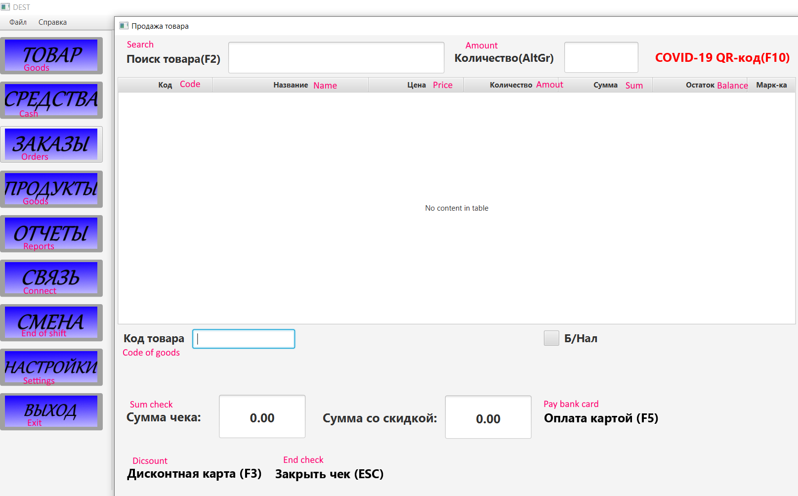
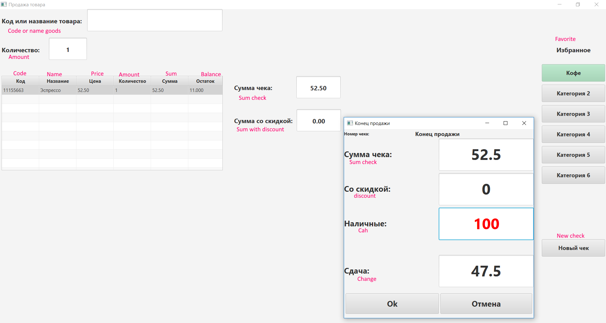
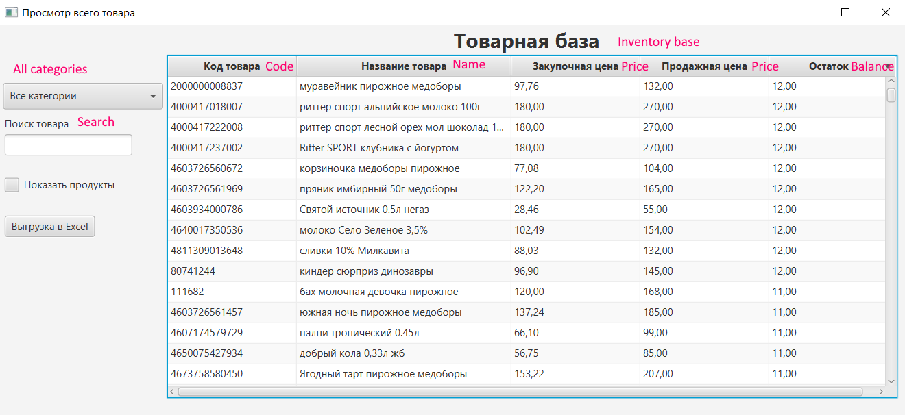
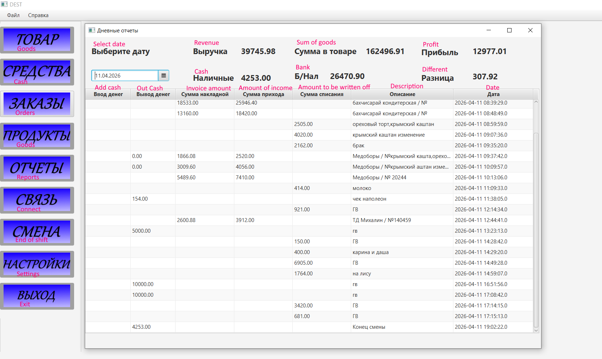
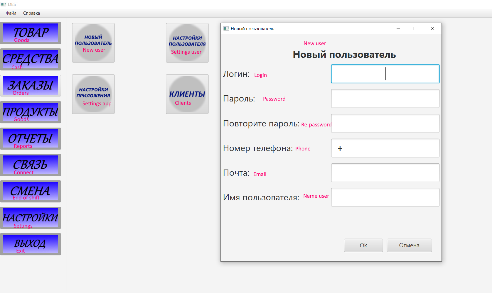

# JavaFX POS Retail Management System

A production-ready desktop-based POS (Point of Sale) and retail management system developed using Java and JavaFX.

The system is designed for real-world retail environments such as shops and cafes.  
It supports inventory management, sales processing, barcode scanning, receipt printing, reporting, and multi-user operations.

This application has been successfully used in real commercial environments across multiple retail locations.

---

## Features

- User authentication system
- Role-based access control (Admin / Cashier)
- Product inventory management
- Sales processing
- Stock receiving management
- Product search and filtering
- Barcode scanning support
- Receipt printing
- Reporting system with filters
- Export reports to Excel/PDF
- Multi-user support
- Logging system
- Database backup functionality
- Hardware integration support

---

## System Roles

### Administrator

- Manage users
- Manage products
- Configure categories
- View reports
- Monitor sales
- Manage system settings

### Cashier

- Process sales
- Scan product barcodes
- Print receipts
- Search products
- View limited reports

---

## System Architecture

The system is built using a layered architecture with separation of responsibilities between UI, business logic, and data access.

### Architecture Overview

UI Layer (JavaFX)  
↓  
Service Layer (Business Logic)  
↓  
DAO Layer (Data Access)  
↓  
MySQL Database  

---

## Main Modules

- User Management
- Inventory Management
- Sales Processing
- Stock Receiving
- Reporting System
- Hardware Integration
- Security Module
- Backup System
- Logging System

---

## Project Scale

- 20,000+ lines of code
- 31 database tables
- 20+ UI screens
- Multi-user system
- Production-ready desktop application
- Used in real retail environments
- Hardware-integrated solution

---

## Technologies Used

- Java
- JavaFX
- MySQL
- Spring Security
- JDBC / ORM
- Barcode Scanner Integration
- Receipt Printer Integration
- Logging Framework
- Excel / PDF Report Export

---

## Hardware Integration

The system supports integration with external hardware devices:

- Barcode scanners
- Receipt printers
- POS cash register devices

Supports real-time product scanning and receipt printing.

---

## Multi-user Support

The system supports simultaneous work of multiple users (cashiers and administrators) connected to the same database.

Designed for real-time operations across multiple workstations.

---

## Logging and Backup

The system includes:

- Application logging
- Error tracking
- Database backup functionality
- Data safety mechanisms

---

## Database

Database schema includes:

- Products
- Categories
- Users
- Roles
- Sales
- Sale Items
- Stock Movements
- Reports
- System Settings
- Backup Tables

Total: **31 tables**

Database schema file:

```
database/schema.sql
```

---

## Screenshots

### Main Dashboard



### Sales Processing



### Inventory Management



### Reporting System



### User Management



---

## How to Run

1. Install MySQL
2. Create a new database
3. Import schema.sql from:

```
database/schema.sql
```

4. Configure database connection settings
5. Run the application using Java IDE (NetBeans / IntelliJ IDEA)

---

## Real-world Usage

This system has been used in:

- Retail shops
- Cafes
- Multi-location business environments

Supports real-time sales operations and inventory tracking.

---

## Future Improvements

- REST API integration
- Web-based administration panel
- Cloud database support
- Advanced analytics dashboard

---

## Author

Java Developer with experience in:

- Retail automation systems
- POS software development
- Hardware integration
- Multi-user database systems
- Backend development

Currently focused on Java Backend and enterprise-level system development.
